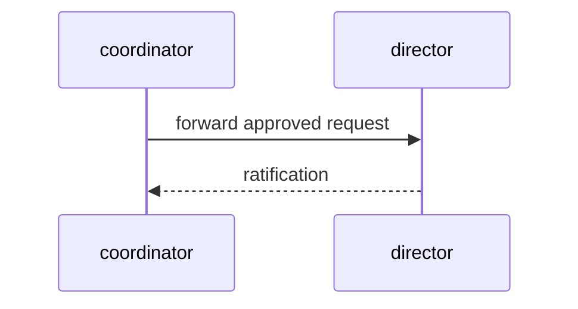

# Grant Privilege Flow

```mermaid
sequenceDiagram
  participant coordinator
  participant director
  coordinator->>director: forward approved request
  director-->>coordinator: ratification
```

The coordinator forwards an approved request, director ratifies and persists state.
