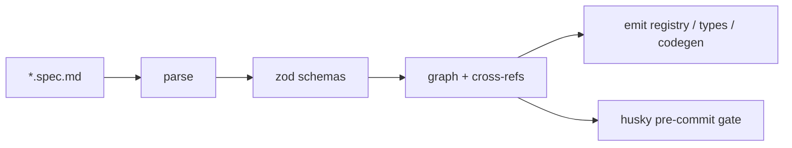

# yhwh — Y · Hydrate · Weave · Hatch

## Mission

A self-referential build model. Author markdown specs (`Hydrate`); the engine validates and weaves them into a graph (`Weave`); the graph hatches into typed TS, registries, and Claude Code artefacts (`Hatch`). The compiler types itself (`Y`, the metacircular fixed point — proved byte-stable in `docs/SELF-HOST-PROOF.md`). Spec is the source of truth. CLI binary: `hwh`.

## Architecture (current)

## SDD workflow

This project uses spec-driven development with **waves**. Single canonical spec (this file). Wave list lives in `.wave/state.json`. Per-wave progress checklist in `.wave/wave-<N>-progress.md`. Findings appended in `.wave/findings/`.

Wave loop, manual today (native CLI later):

1. `hwh wave status` — list waves, current = first not done
2. Read `.wave/wave-<N>-progress.md`, work item-by-item
3. Tick `[ ]` → `[x]` as each acceptance criterion ships
4. When all ticked: validate, run E2E, mark wave `done` in `state.json`, commit `feat(wave-<N>): <name>`
5. `hwh wave next` — bootstrap next wave's progress file

## What's done (Phases 0–8)

Bootstrap, parse, agent/skill/flow/entity/harness/ralph schemas, mermaid mini-AST, 9 cross-rules, registry+types+codegen, husky gate, GitHub Actions, `hwh new/watch/apply/doctor`, entity invariants DSL.

## What's next

This file is the canonical anchor; waves are tracked in `.wave/state.json`.

## Invariants

1. The SemanticModel is the only contract between parser and generators.
2. Canonical form is a fixed point of `parse ∘ render` (target after wave 2).
3. Refs are typed by kind in TypeScript.
4. Predicates are the only handwritten primitives.
5. Diagnostics carry source ranges.
6. `_bootstrap/` exists from wave 6 and is removable without test breakage at `bootstrap-complete` tag.
